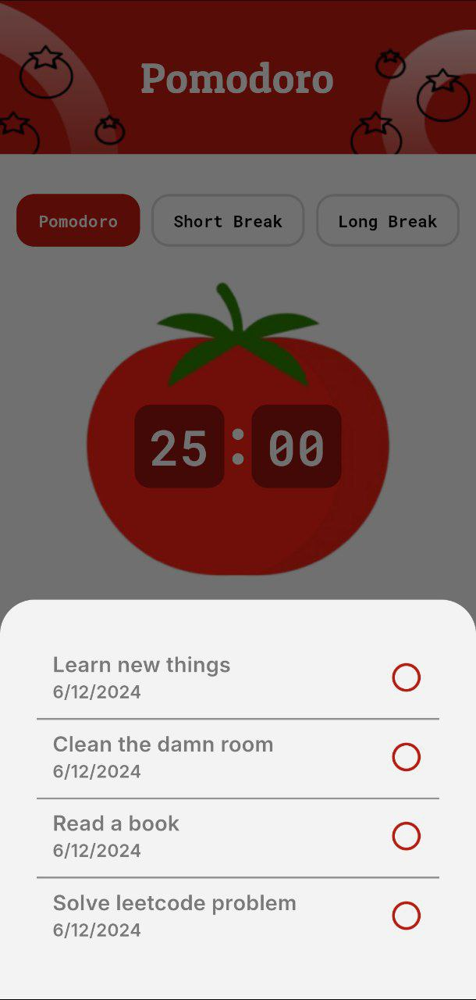

# pomodoro

A simple Pomodoro Appication to boost your productivity. App can help you to focus on the task you want to finish by completing pomodoros. In this application users can add the task they want to do, they can finish the tasks by completing the pomodoros and users can keep track of tasks that they fnished each day. App's functionalites are pomodoro timer, todo list and history of tasks which have been finished. Made by Abdusalom G'ayratov December 2024.

## Getting Started

  
    
    
     
      
       
        
         
          

